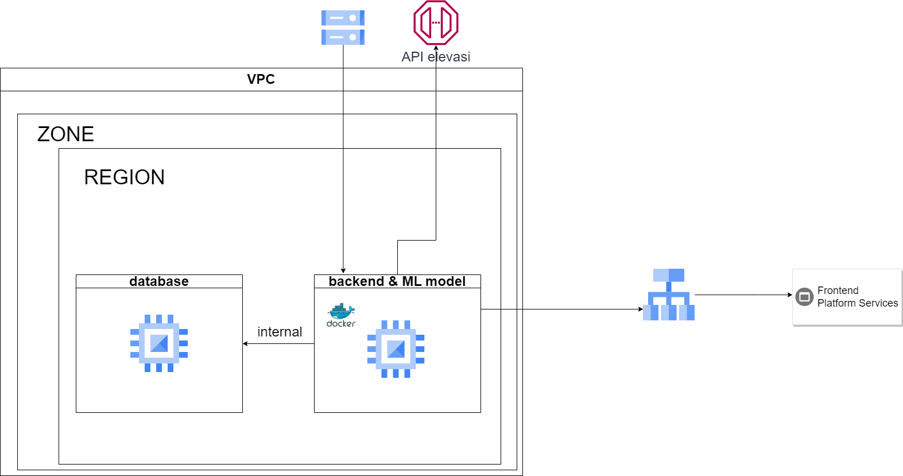

# Instalasi Aplikasi Web Menggunakan Laravel

## Prasyarat
Sebelum menginstal Laravel, pastikan sistem Anda memiliki prasyarat berikut:
- PHP (versi 7.3 atau lebih tinggi)
- Composer
- MySQL


## Langkah Instalasi

### 1. Clone Repository
Clone repository dengan perintah:
```sh
git clone https://github.com/green-advisor/backend.git
cd backend
```

### 2. Install Dependencies
Jalankan perintah berikut untuk menginstal semua dependensi Laravel:
```sh
composer install
```

### 3. Konfigurasi Environment
Salin file `.env.example` menjadi `.env` dan ubah konfigurasi sesuai kebutuhan:
```sh
cp .env.example .env
```
Edit file `.env` untuk mengatur konfigurasi database:
```
DB_CONNECTION=mysql
DB_HOST=127.0.0.1
DB_PORT=3306
DB_DATABASE=nama_database
DB_USERNAME=username
DB_PASSWORD=password
```

### 4. Generate Application Key
Jalankan perintah berikut untuk menghasilkan application key:
```sh
php artisan key:generate
```

### 5. Migrasi dan Seeding Database
Jalankan perintah berikut untuk membuat tabel database dan data dummy:
```sh
php artisan migrate 
php artisan dn:seed
```

### 6. Jalankan Server
Jalankan perintah berikut untuk menjalankan server Laravel:
```sh
php artisan serve
```
Aplikasi sekarang dapat diakses melalui `http://127.0.0.1:8000`.


## Deployment
Untuk deployment di server, gunakan perintah berikut:
```sh
php artisan config:cache
php artisan route:cache
php artisan view:cache
```


---

Sekarang aplikasi Laravel Anda telah terinstal dan siap digunakan!

